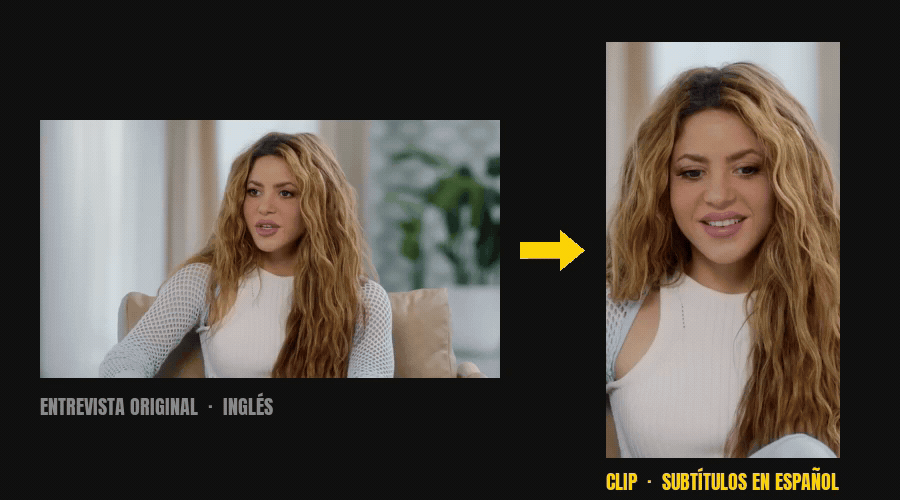
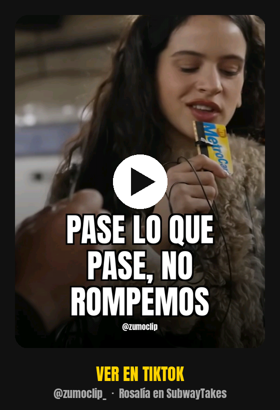

# Zumoclip 🧃

**Subtítulos en español, portadas y carruseles para [OpenShorts](https://github.com/mutonby/openshorts). Todo en local, sin subir vídeo a nadie.**



[](LICENSE)
[](https://www.python.org/)
[](https://github.com/mutonby/openshorts)
[]()
[](https://x.com/boldtonic)
[](https://www.linkedin.com/in/ferrullan/)

> **Estas herramientas se apoyan en [OpenShorts](https://github.com/mutonby/openshorts)** — MIT, de Juan Carlos Cavero. Instálalo primero: él hace el trabajo pesado (transcripción, selección de momentos, reencuadre a 9:16). Este repo añade lo que a nosotros nos faltaba para publicar de verdad.

OpenShorts convierte una entrevista larga en clips verticales con subtítulos **en el idioma original**. Si tu canal publica en español entrevistas grabadas en inglés, eso no te vale: necesitas el subtítulo traducido, conservando la voz original. Y necesitas portada, carrusel y control sobre a quién enfoca la cámara.

Eso es lo que hay aquí.

<p align="center">
  <a href="https://www.tiktok.com/@zumoclip_/video/7682481214615244054">
    
  </a>
  <br>
  <sub>Hecho con estas herramientas. Voz original, subtítulo en español.</sub>
</p>

---

## Qué añade

- **Subtítulos traducidos al español** — el repo original solo dobla con ElevenLabs; esto traduce la transcripción y la quema como subtítulo, manteniendo la voz del entrevistado
- **Portadas verticales** — 1080x1920, mejor fotograma por cara y nitidez, titular en Anton con palabra destacada
- **Variante para TikTok** — TikTok recorta la portada por arriba en la cuadrícula del perfil; esta versión baja la etiqueta de serie a la zona que sobrevive al recorte
- **Carruseles** — 1080x1350 (4:5), un fotograma por frase con el texto encima
- **Control manual del reencuadre** — expone tres cosas que OpenShorts tiene en su API pero no en la línea de comandos: corte por hablante, plano cerrado forzado y encuadre fijado a mano escena por escena, incluida la pantalla dividida en una escena concreta

---

## Instalación

Primero OpenShorts:

```bash
git clone https://github.com/mutonby/openshorts.git ~/openshorts
cd ~/openshorts && python3.11 -m venv .venv
./.venv/bin/pip install -r requirements.txt
```

Luego esto:

```bash
git clone https://github.com/boldtonic/zumoclip.git
cp zumoclip/scripts/*.py ~/openshorts/
```

**Dos dependencias que no son opcionales:**

```bash
brew install ffmpeg-full deno
```

- **`ffmpeg-full`** — la fórmula `ffmpeg` normal de Homebrew **viene sin `libass`** y no puede quemar subtítulos. Falla con `Error opening output files: Filter not found`. Homebrew además no la enlaza, así que hay que invocarla por ruta completa.
- **`deno`** — YouTube exige un runtime de JavaScript para que yt-dlp extraiga los formatos.

**Configuración por variables de entorno:**

```bash
export OPENSHORTS_HOME=~/openshorts
export FFMPEG=/opt/homebrew/Cellar/ffmpeg-full/9.0.1_1/bin/ffmpeg
```

La API key de Gemini va en `$OPENSHORTS_HOME/.env`.

---

## Uso

**1. Traducir el tramo de un clip al español**

```bash
python traducir_rango.py METADATA.json INICIO FIN salida.json
```

Recorta cada segmento a las palabras audibles **antes** de traducir. Es la parte que más importa: Whisper agrupa por frases que se salen del corte, y traducir la frase entera hace que se pierda texto por los extremos del clip.

El JSON resultante es texto plano y se edita a mano. Corregir una traducción no cuesta ni una llamada a la API.

**2. Quemar los subtítulos**

```bash
python subs_es.py salida.json CLIP_LIMPIO.mp4 DURACION FINAL.mp4
```

Anton en mayúsculas, palabra activa en amarillo, contorno negro. `max_chars=14` en español.

**3. La portada**

```bash
python portada.py CLIP.mp4 "Titular" portada.jpg "PALABRA" MAXSEG "Tag de serie" MINSEG
python portada_tiktok.py portada.jpg portada_tiktok.jpg "Tag de serie"
```

**4. El carrusel**

```bash
python carrusel.py CLIP.mp4 SALIDA/ "Tag de serie" \
  "10.2:Deseando menos:MENOS" "12.9:Ya no medito tanto. Rezo más:REZO"
```

Cada diapositiva es `SEGUNDO:Texto[:PALABRA_AMARILLA[:ZOOM[:X]]]`.

**5. Reencuadre con control**

```bash
python reframe.py TRAMO.mp4 --escenas              # indices de escena
python reframe.py TRAMO.mp4 SALIDA.mp4 cut         # corta a quien habla
python reframe.py TRAMO.mp4 SALIDA.mp4 track       # plano cerrado siempre
python reframe.py TRAMO.mp4 SALIDA.mp4 track '{"0":0.36}'   # encuadre a mano
python reframe.py TRAMO.mp4 SALIDA.mp4 track '{"5":{"top":0.16,"bottom":0.54}}'   # pantalla dividida en una escena
```

---

## Lo que aprendimos por las malas

Está todo en **[PROCESO.md](PROCESO.md)**, con los comandos exactos y una tabla de fallos conocidos. Lo crítico:

**El modelo acierta el tema y falla el borde del corte.** En las dos direcciones: una vez se pasó 26 segundos, otra cortó 0,02 s antes del remate. Hay que verificar siempre contra la transcripción que el clip no empieza ni acaba a mitad de frase, y que **la última palabra entra entera**.

**El TRACK no sigue a quien habla.** Elige una cara al arrancar la escena y se queda con ella. En una conversación a dos puedes acabar viendo al entrevistador el clip entero mientras habla el invitado. Para eso está el modo `cut`.

**Y apagar `SPLIT_LAYOUT` no lo apaga**: el selector automático lo vuelve a encender por diseño. Hay que forzar los módulos desde Python, que es justo lo que hace `reframe.py`.

**El detector de caras elige la más grande**, y en una entrevista esa suele ser la del entrevistador porque está más cerca de la cámara. Por eso las portadas y los carruseles aceptan coordenada horizontal.

**Comprueba la fuente antes de descargar novecientos megas.** Que tenga vídeo real y no una carátula fija, que no lleve marca de agua quemada, y que tenga audiencia. Tres comprobaciones de diez segundos cada una.

---

## Coste

Whisper corre en local y no cuesta nada. Gemini solo interviene al elegir momentos y al traducir.

**Unos $0,00032 por minuto de vídeo fuente.** Una entrevista de una hora sale por unos dos céntimos. Iterar es gratis: recortar, resubtitular, regenerar portadas y montar carruseles no llama a ninguna API.

---

## Créditos

**[OpenShorts](https://github.com/mutonby/openshorts)** de Juan Carlos Cavero hace todo el trabajo pesado — yt-dlp, faster-whisper, PySceneDetect, selección de clips con Gemini, reencuadre a 9:16 con MediaPipe y YOLOv8, y los subtítulos ASS. MIT, salvo el directorio `cloud/`, que va bajo su licencia comercial.

Este repo **no incluye ni modifica** su código: son scripts que se apoyan encima.

De ellos, `reframe.py` es un envoltorio fino sobre su propia API — lo único que aporta es exponer desde la línea de comandos tres cosas que ya existen dentro. El resto (`traducir*.py`, `subs_es.py`, `portada*.py`, `carrusel.py`) es código nuevo.

---

## Licencia

MIT. Ver [LICENSE](LICENSE).
